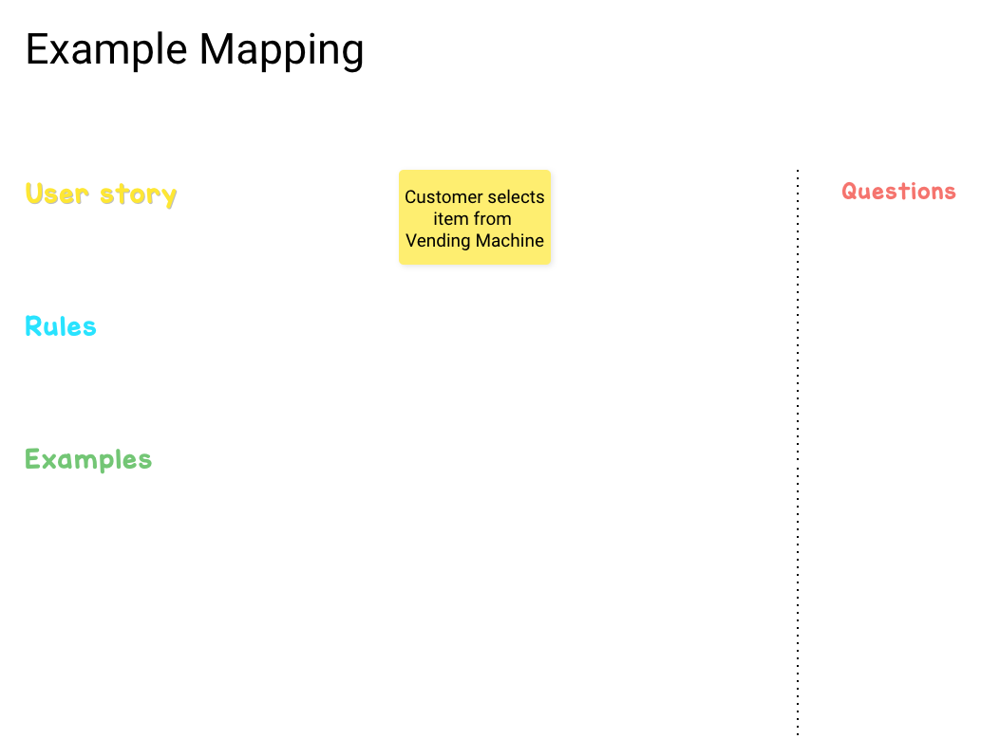
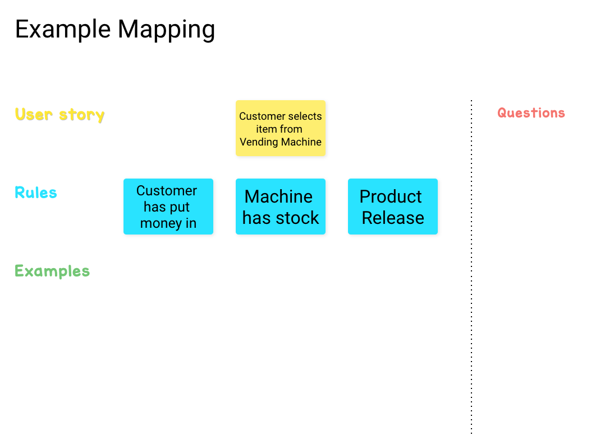
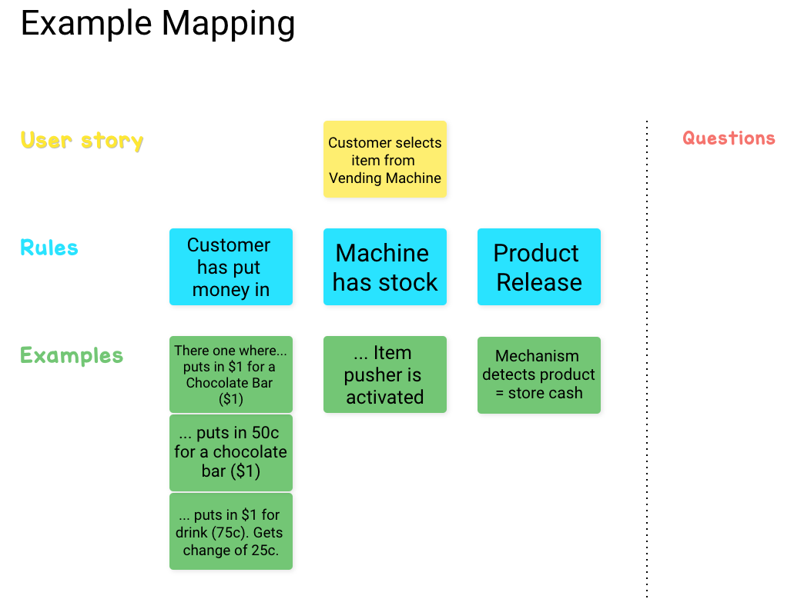
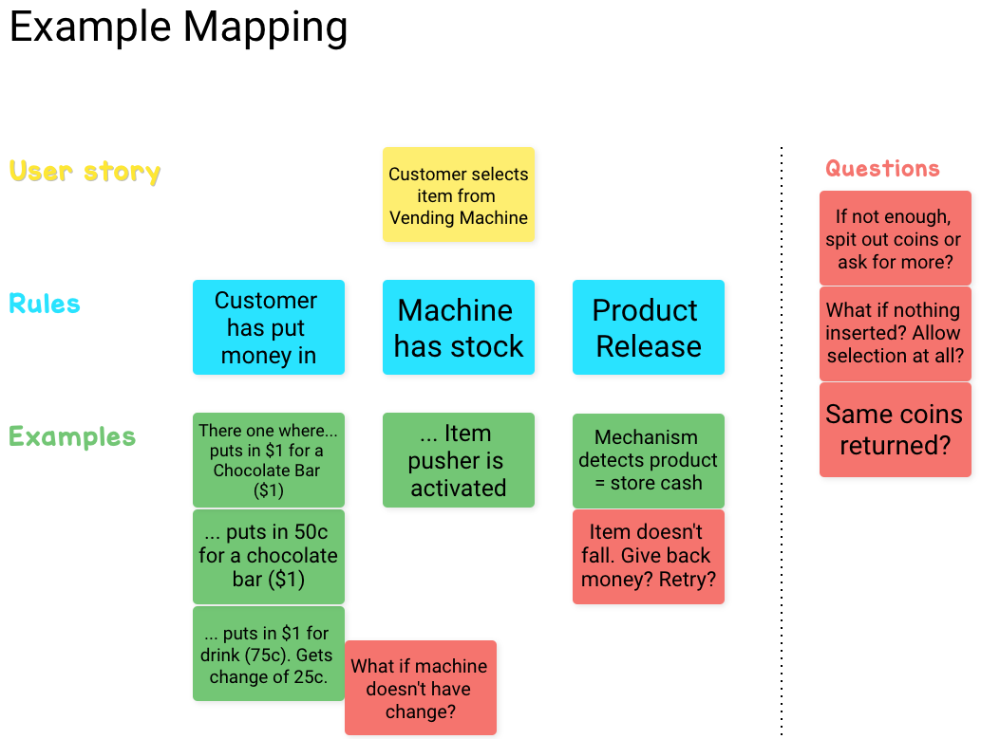

theme: Sketchnote, 2

# Collaboration Done Right

### @garyfleming

^ Intro

---

# BDD Is About Alignment

^ Ever had Dev/test argue? Dev says it meets the spec, test says it's broken. Alignment. PO/ says "it's not what I wanted". Conversation earlier to avoid.

---

# TDD and BDD
## Why are _we_ talking about it?

^  - TDD drives concrete design from specs
^  - BDD helps build that spec in the large (i.e. system level)
^  - Double-loop Process 

^ Double loop: find stories, verify, create, verify, create
^ TDD pointless without direction

---

# BDD - What it's not
## Not a testing process

^ Seems to be a misconception based on test-after philosophy
^ Often see teams develop "the BDDs" as a tool using 

---

# BDD - What it's not
## Not a tool

^ The relationship of tools like Cucumber and SpecFlow to BDD are clear, but you can do BDD without any tools to a very large extent.

---

## BDD - What it is

^ With what it's not covered, we can start to see what it is: a way of thinking about the behaviours we want our systems to have. That is, it's a bunch of alignment and analysis tools, in the same way that TDD is a bunch of Design tools.

---

# The BDD Books
## Seb Rose (Cucumber)
## Gáspár Nagy (SpecFlow) 

^ Wrote/writing a series of books that take the history of BDD and the next 20 years of development in the area and distill it down into three main practices - one practice per (short) book

---

## BDD is three practices

  - Discovery
  - Formulation
  - Automation

^ Three practices. If you do these practices in a disciplined way, you're more likely to have good outcomes.

---

## Discovery
### A way of thinking about and exploring the behaviours we want in our systems

^ "Shared understanding is established through collaboration and structured conversations"
^ Three amigos. Structured conversations.
^ Not trying to word lawyer! just capturing example

---

# SKIP!

^ Skipping this for now. That's the workshop

---

## Formulation
### A way of writing down the behaviours in a clear way that we can all agree on 

^ "Examples of system behaviour are documented as scenarios"
^ Think we've refined and aligned in Discovery, answered enough questions. Time to Formulate.

---

```
SCENARIO: sc_1_4_75_for_100_choc_fail
GIVEN vending machine has stock
AND vending machine has no coins
AND customer inserts a coin of value "5"
AND customer inserts a coin of value "10"
AND customer inserts a coin of value "10"
AND customer inserts a coin of value "25"
AND customer inserts a coin of value "25
WHEN customer presses button "A"
AND customer presses button "1"
AND customer presses button "4"
AND customer presses button "vend"
THEN the screen says "Please insert another 25 cents"
```

---

# BRIEF 
  - Business Language 
  - Real data 
  - Intention Revealing 
  - Essential 
  - Focused

^ Acronym used to help make scenarios we right focussed in the right way
^ Aids cross-discipline collaboration
^ Reveal assumptions and edge cases
^ Describe desired outcomes, rather than implementation
^ Skip anything that isn't directly about the behaviour
^ Each scenario should only be about one rule

---

```
SCENARIO: customer hasn't paid enough
GIVEN the customer has inserted 75 cents
WHEN customer picks a one dollar chocolate bar
THEN the screen says "Please insert another 25 cents"
```

---

## Automation
### A way of ensuring those behaviours are verified in the system, using tooling.

^ The easy part if we've done the rest right!
^ "Scenarios are automated to be able to verify the system's behaviour"
^ Tools like Cucumber or SpecFlow take our scenarios and match them up to methods in our test code.
^ Show an example match.

---

```
centsInserted = 0;

Given('customer has inserted {int} cents', function (cents) {
  this.centsInserted = cents;
});
```

--- 

# Back to Discovery
## Example Mapping

^ Need a technique that allows us to do discovery, while getting different perspectives.

---




^ Start with a story that we want to elaborate.
^ Purpose is to bring all perspectives... align... discover.

---



^ Rules summarise examples, or illustrate constraints.

---



^ Examples. Concrete


---



^ Questions. Can tie to tickets or the overall story.
^ I presented these in order, but it's messier. Start with a story, but add as you come up. Examples first, some questions, form rules etc.

---


^ Framework to have a conversation, not the conversation.
^ Not prescriptive. Feel free to bend the framework.
^ Consequences of too many of each.
^ Timeboxed to 20 minutes a day.

---

# Your Story.

Context: Booking system for cinema adding pre-selected seating.

Story: A family of four books to see a film.


^ We don't have a system to build new features on so have to imagine one, and any difficulties that might exist.
^ Think about where the edge cases for this are. Empty cinema is probably easy. Scattered seating, maybe not.


---

# Credits

"Introduction to BDD" by Dan Terhorst-North
"BDD Books" series by Seb Rose and Gaspar Nagy
